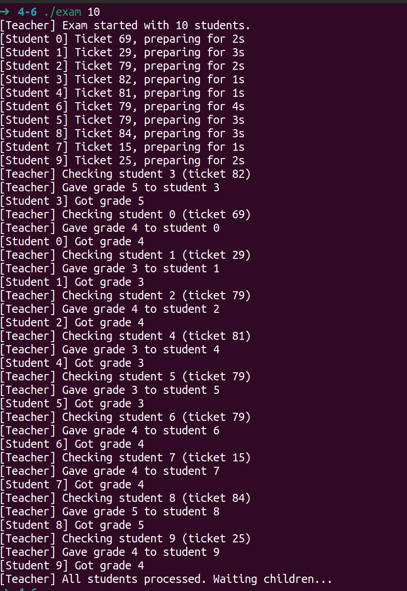
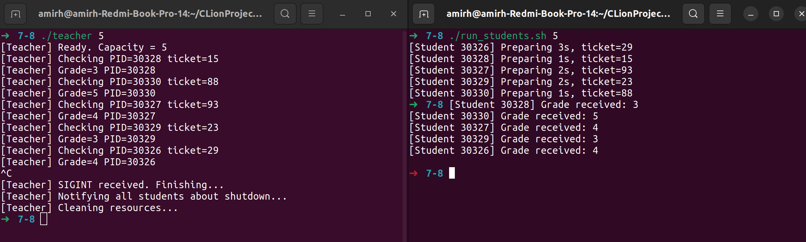

# **ИДЗ №3**

- **Тема:** Моделирование экзамена (преподаватель и студенты)
- **Дисциплина:** Архититектура компьютера и операционных систем
- **Исполнитель:** Хазеев Амир Айратович
- **Группа:** БПИ-247
- **Вариант:** 29

---

# 1. Условие задачи

Преподаватель проводит экзамен у группы студентов. Каждый студент получает билет, готовится случайное время, затем передает свой ответ преподавателю. Преподаватель также случайное время проверяет работу и сообщает студенту оценку.

**Требуется:** создать многопроцессное приложение, моделирующее эти действия, используя парадигму *клиент–сервер*.

---

# 2. Сценарий моделируемой системы

Участвуют два типа процессов:

* **Преподаватель (server)**
* **Студенты (clients)**

**Основной протокол работы:**

1. Студент готовится случайное время.
2. Регистрируется у преподавателя (подаёт заявку).
3. Преподаватель выбирает следующего студента из очереди.
4. Проверяет его работу.
5. Выставляет оценку.
6. Студент получает оценку, подтверждает получение и завершает процесс.

---

# 3. Реализация по уровням оценки

---

# **3.1. Реализация на 4–6 баллов**

Этот уровень реализован в программе `exam.cpp`, где вся модель находится в одном исполняемом файле.

## 3.1.1. Архитектура

* Один процесс-преподаватель, создающий дочерние процессы студентов через `fork()`.
* Используется общая разделяемая память созданная через:

```c
mmap(MAP_SHARED | MAP_ANONYMOUS)
```

* Внутри памяти располагаются:

    * структуры данных,
    * массивы состояния,
    * массивы неименованных семафоров.

## 3.1.2. IPC-механизмы

Используются:

* **Неименованные POSIX-семафоры**:

    * mutex — защита общих структур,
    * queue — количество готовых студентов,
    * per-student grade_sem[i] и ack_sem[i].
* **Разделяемая память (mmap anonymous)**
* **Сигналы** для корректного завершения (`SIGINT` → остановка всех процессов)

## 3.1.3. Структура общей памяти

```c
struct SharedHeader {
    sem_t mutex;             // защита массива
    sem_t queue;             // количество готовых студентов
    bool running;            // флаг завершения
    int N;                   // количество студентов
    int tickets[N];          // билеты
    int grades[N];           // оценки
    int state[N];            // состояние студента
    sem_t grade_sem[N];      // преподаватель → студент
    sem_t ack_sem[N];        // студент → преподаватель
};
```

## 3.1.4. Алгоритм студента

1. Ждёт случайное время (подготовка).
2. Записывает свой билет в общую память.
3. Помечает себя как готового (`state[i] = 1`).
4. Делает `sem_post(queue)`.
5. Ждёт оценку (`sem_wait(grade_sem[i])`).
6. Выводит оценку.
7. Подтверждает получение: `sem_post(ack_sem[i])`.

## 3.1.5. Алгоритм преподавателя

1. Ждёт готового студента: `sem_wait(queue)`.
2. Выбирает студента из массива состояний.
3. Проверяет работу (sleep).
4. Ставит оценку.
5. `sem_post(grade_sem[i])`.
6. Ждёт подтверждение `ack_sem[i]`.

## 3.1.6. Корректное завершение

При `SIGINT`:

* флаг `running = false`,
* преподаватель будит все семафоры,
* студенты завершаются корректно.

## 3.1.7. Тестирование



---

##  Что было реализовано на 4–6 баллов

На этом уровне были реализованы:

* Полностью рабочая модель в одном процессе: `fork()` создаёт студентов.
* Общая разделяемая память через `mmap(MAP_SHARED | MAP_ANONYMOUS)`.
* Неименованные семафоры внутри этой памяти.
* Логика очереди и синхронизации:
  `mutex`, `queue`, `grade_sem[i]`, `ack_sem[i]`.
* Безусловно корректное завершение по `SIGINT` (разброс `sem_post`).
* Отсутствие deadlock'ов и гонок.

## Запуск

Для 4–6 баллов используется ОДИН исполняемый файл:

```bash
g++ exam.cpp -o exam
./exam <количество_студентов>
```

Таким образом, полностью выполнены требования 4–6 баллов.

---

# **3.2. Реализация на 7–8 баллов**

Этот уровень сменяет архитектуру: больше нет монолитной программы — теперь система состоит из **раздельных процессов**.

Программы:

* `teacher` — сервер
* `student` — клиент
* (observer добавится далее на 9 баллов)

## 3.2.1. Архитектура

### Сервер

Запускается первым. Создаёт:

* именованную shared memory (`shm_open`)
* именованные семафоры `/exam_mutex`, `/exam_queue`

### Клиенты

Каждый `student` запускается отдельно, подключается к shared memory и создаёт свои именованные семафоры.

---

## 3.2.2. Структура данных SharedData

```c
struct StudentSlot {
    pid_t pid;
    int ticket;
    int grade;
    SlotState state;
    char grade_sem_name[64];
    char ack_sem_name[64];
};

struct SharedData {
    int capacity;
    bool shutdown;
    int active_students;
    StudentSlot slots[];
};
```

Каждый слот соответствует одному студенту.

---

## 3.2.3. Используемые IPC-механизмы

* **POSIX shared memory**:

  ```c
  shm_open("/exam_shm", O_CREAT | O_RDWR)
  ```
* **Именованные семафоры**:

    * `/exam_mutex` — глобальная блокировка
    * `/exam_queue` — очередь студентов
    * `/grade_<pid>`, `/ack_<pid>` — персональные семафоры
* **Сигналы** — корректное завершение при SIGINT

---

## 3.2.4. Логика преподавателя (`teacher.cpp`)

Основной цикл:

```c
sem_wait(queue_sem);
find WAITING slot;
set state = PROCESSING;
sleep(...);      // проверка
sem_open(grade_sem_name);
sem_post(grade);
sem_wait(ack);
free slot;
```

Также при SIGINT:

* уведомляет студентов,
* ставит всем `grade = -1`,
* устанавливает `shutdown = true`,
* пробуждает `queue_sem`.

---

## 3.2.5. Логика студента (`student.cpp`)

1. Создаёт два именованных семафора:
   `/grade_<pid>` и `/ack_<pid>`.
2. Готовится (sleep).
3. Занимает слот в shared memory.
4. Увеличивает `queue_sem`.
5. Ждёт оценки.
6. При получении выводит результат.
7. Делает `sem_post(ack)`.
8. Удаляет свои именованные семафоры.

---

## 3.2.6. Тестирование 



##  Что было реализовано на 7–8 баллов

На этом уровне реализовано:

*  **Переход от монолита к реальным клиентам/серверу** — процессы независимы.
*  **Использование POSIX shared memory (`shm_open`) вместо anonymous mmap**.
*  **Именованные семафоры** вместо неименованных.
*  **Гибкая система слотов**: каждый студент занимает структуру StudentSlot.
*  **Поддержка ограничений capacity** — студенты не занимают больше, чем разрешено.
*  **Корректное завершение** при SIGINT, включая уведомление всех студентов.
*  **Отсутствие гонок и защиты общих данных через `/exam_mutex`**.

## Запуск
- Компилируем:

```bash
g++ teacher.cpp -o teacher
g++ student.cpp -o student
```

1. Запустить преподавателя (в отдельном терминале):

```bash 
./teacher <capacity>
```

2. Запускать студентов вручную (в отдельных терминалах):

```bash
./student
```

3. Запустить много студентов с помощью скрипта (предоставленный файл run_students.sh):

```bash 
chmod +x run_students.sh
./run_students.sh <кол-во>
```

Это полностью соответствует требованиям 7–8 баллов.

---

# **4. Реализация на 9 баллов — добавленный наблюдатель**

В систему добавлен отдельный процесс **observer**, который собирает поток сообщений от всех процессов.

Это позволяет наблюдать текущее состояние системы в реальном времени.

---

## 4.1. IPC для наблюдателя

Используется **именованный канал FIFO**:

```c
mkfifo("/tmp/exam_log", 0666);
```

* `teacher` и `student` записывают туда события.
* `observer` читает их.

---

## 4.2. Архитектура `observer.cpp`

* Открывает FIFO в не блокирующем режиме (`O_NONBLOCK`).
* В цикле читает данные.
* При отсутствии данных ждёт 100 мс.
* При закрытии писателей переподключается.
* Завершается по SIGINT (печатает `[Observer] Shutdown.`).

---

## 4.3. Поведение observer

```c
while (running) {
    read(fd, buf);
    print;
    sleep(100ms);
}
```

Не блокирует работу teacher/student.

---

## 4.4. Модификация teacher/student

Обе программы логируют действия двумя способами:

1. В собственную консоль.
2. В FIFO (через `write(fifo_fd, ...)`).

Это создаёт единый поток логов для наблюдателя.

---

## 4.5. Пример вывода observer

```
[TEACHER] Ready. Capacity=5
[STUDENT 4121] Preparing 2s, ticket=31
[STUDENT 4121] Registered in slot 0
[TEACHER] Checking PID=4121 ticket=31
[TEACHER] Grade=4 PID=4121
[STUDENT 4121] Received grade: 4
[TEACHER] SIGINT received, finishing...
[Observer] Shutdown.
```

---

##  Что было реализовано на 9 баллов

На этом уровне добавлено:

*  Отдельный процесс-наблюдатель `observer`.
*  Новый IPC-механизм: именованный pipe FIFO `/tmp/exam_log`.
*  Двойное логирование событий (в консоль + в FIFO).
*  Неблокирующее чтение FIFO (O_NONBLOCK) → система не зависает.
*  Корректное завершение всех процессов при SIGINT.
*  Возможность запускать observer независимо от teacher/student.

## Запуск
- Компилируем:

```bash
g++ teacher.cpp -o teacher
g++ student.cpp -o student
g++ observer.cpp -o observer
```

1. Запустить наблюдателя (в отдельном терминале)

```bash
./observer
```

2. Запустить преподавателя (в отдельном терминале):

```bash 
./teacher <capacity>
```

3. Запустить студентов вручную (в отдельных терминалах):

```bash
./student
```

4. Запустить много студентов с помощью скрипта (предоставленный файл run_students.sh):

```bash 
chmod +x run_students.sh
./run_students.sh <кол-во>
```

Это полностью соответствует требованиям для оценки **9 баллов**.

---

## 6. Вывод

1. На уровне **4–6 баллов** была реализована монолитная модель экзамена в одном исполняемом файле `exam.cpp`:

* процессы студентов создаются через `fork()`;
* используется anonymous `mmap` для общей памяти;
* синхронизация реализована неименованными семафорами внутри этой памяти;
* обеспечена корректная логика взаимодействия преподавателя и студентов и корректное завершение работы.

2. На уровне **7–8 баллов** была построена полноценная клиент–серверная архитектура:

* система разделена на независимые процессы `teacher` и `student`;
* используется POSIX shared memory (`shm_open`, `mmap`);
* применяются именованные семафоры (глобальные и per-student);
* реализована система слотов `StudentSlot` с учётом ограничения `capacity`;
* обеспечена корректная обработка `SIGINT` и освобождение всех ресурсов.

3. На уровне **9 баллов** был добавлен независимый наблюдатель `observer`:

* введён дополнительный IPC-механизм — именованный FIFO `/tmp/exam_log`;
* реализовано двойное логирование действий всех процессов;
* обеспечено неблокирующее наблюдение за системой в реальном времени;
* все процессы (teacher, students, observer) корректно завершают работу и освобождают ресурсы.


---